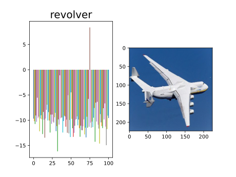

# 学习FGSM(Fast Gradient Sign Method)

Classify文件夹内实现了一个分类识别的神经网络，训练完成后得到权重文件才可进行FGSM攻击。

attack文件夹中有FGSM的实现，可运行代码查看效果

## FGSM效果

下表为使用FGSM对抗攻击后的前后对比效果。

原始图片效果          |  攻击后的图片效果
:-------------------------:|:-------------------------:
  |

## iFGSM效果

除了有FGSM的实现，代码还实现了iFGSM，即多次迭代FGSM。

下表为两种方法的对比效果，此处的条件为$\epsilon_{\mathrm{FGSM}} = i*\epsilon_{\mathrm{iFGSM}}$，$i$为迭代次数。

FGSM          |  iFGSM（迭代10次）
:-------------------------:|:-------------------------:
  |

## Targeted iFGSM效果
Target is wrench          | Targeted is dragonfly 
:-------------------------:|:-------------------------:
  |

## 原理

### FGSM原理

$$
x^{\prime}=x+\epsilon\cdot\mathrm{sign}(\nabla_{x}J(\theta,x,y))
$$

### iFGSM原理

$$
x^{(0)}=x^{n}
$$
$$
x^{(i+l)}=\mathrm{Clip}_{x,\epsilon}\left(x^{(i)}+\epsilon\cdot\mathrm{sign}(\nabla_{x}J(\theta,x^{(i)},y))\right)
$$

### 有目标的FGSM实现原理

对于无目标FGSM，我们的想法是：

$$
\operatorname{maxmize}~J(\theta,x^{\prime},y), \quad~\text{s.t.}~\|x^{\prime}-x\|_{\infty} < \epsilon,
$$

而对于有目标的FGSM，我们的想法则是：

$$
\operatorname{minimize }~J(\theta,x^{\prime},y^{\prime}),\quad\text{s.t.}~\|x^{\prime}-x\|_{\infty} < \epsilon
$$

其中，$x~$为原始图像，$x^{\prime}~$为对抗攻击后的图像，$y~$为真实的标签，$y^{\prime}~$为对抗攻击中的目标标签。

所以它的实现公式为：

$$
x^{\prime}=x{\color{red}-}\epsilon\cdot\mathrm{sign}(\nabla_{x}J(\theta,x,y^{\prime}))
$$

此处与FGSM相比只有微小的区别。

## 参考：

[https://pytorch.org/tutorials/beginner/blitz/cifar10_tutorial.html](https://pytorch.org/tutorials/beginner/blitz/cifar10_tutorial.html)

[https://colab.research.google.com/github/ashishpatel26/Awesome-Pytorch-Tutorials/blob/main/17.Pytorch Transfer learning with Caltech101.ipynb](https://colab.research.google.com/github/ashishpatel26/Awesome-Pytorch-Tutorials/blob/main/17.Pytorch%20Transfer%20learning%20with%20Caltech101.ipynb)

[https://github.com/Harry24k/FGSM-pytorch](https://github.com/Harry24k/FGSM-pytorch)

[https://github.com/1Konny/FGSM](https://github.com/1Konny/FGSM)

